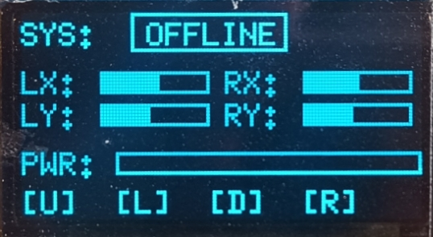
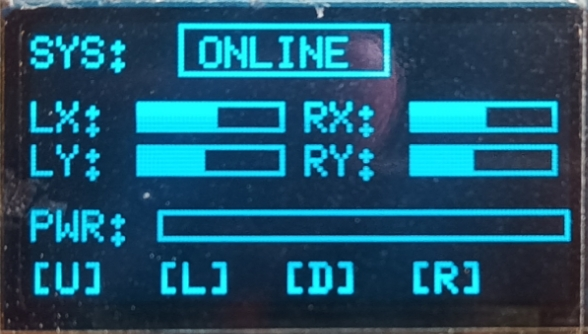

# Rust_Borad_II-Controller-
This is a DIY controller capable of connecting to bluetooth, WiFi and 2.4GHz radio.
It can be connected to PC or Phone.
To play games in PC, you will need to have 'steam' software in your system and connect it with generic controller enabled.

# Display_Outputs-
<table>
  <tr>
    <td>
      
    </td>
    <td>
      <h2>System: Offline</h2>
      

        This is the Main display interface.
        System displays 'OFFLINE' when it is NOT connected to Bluetooth.
      

    </td>
  </tr>
</table>

<table>
  <tr>
    <td>
      
    </td>
    <td>
      <h2>System: Online</h2>
      

        In the main display interface, system displays 'ONLINE' after Bluetooth is connected.
      

    </td>
  </tr>
</table>
